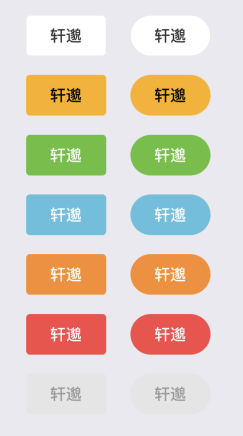
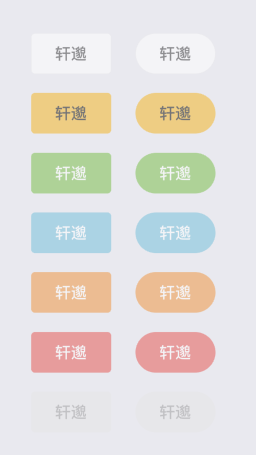
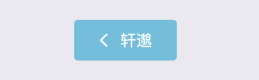
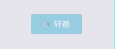
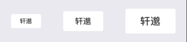

Button

按钮

### type默认default，round默认为true



```js
<View style={styles.container}>
        <View style={styles.rowItem}>
          <Button type={'default'}>轩邈</Button>
          <Button type={'primary'}>轩邈</Button>
          <Button type={'success'}>轩邈</Button>
          <Button type={'info'}>轩邈</Button>
          <Button type={'warning'}>轩邈</Button>
          <Button type={'danger'}>轩邈</Button>
          <Button type={'disabled'}>轩邈</Button>
        </View>
        <View style={styles.rowItem}>
          <Button type={'default'} round>轩邈</Button>
          <Button type={'primary'} round>轩邈</Button>
          <Button type={'success'} round>轩邈</Button>
          <Button type={'info'} round>轩邈</Button>
          <Button type={'warning'} round>轩邈</Button>
          <Button type={'danger'} round>轩邈</Button>
          <Button type={'disabled'} round>轩邈</Button>
        </View>
</View>
```

### disabled 默认false



```js
<Button type={'info'} disabled>轩邈</Button>
```

### icon 和iconPosition 默认left (left、right)



```js
<Button type={'info'} icon={require('SPImg/public/back_white.png')}>轩邈</Button>
```

### loading 默认为true



### size 默认值为 md  （sm 、md、lg）



```js
<Button size={'sm'}>轩邈</Button>
<Button>轩邈</Button>
<Button size={'lg'}>轩邈</Button>
```

